# 博客在github静态部署

## vuepress模板部署
1.首先在[vuepress](https://vuepress.vuejs.org/zh/)中找到一个合适的主题，我选择的是hope主题,然后我简单说一下，选择快速入门，按照步骤安装一些必要的环境，比较简单没有什么好说的
2.创建一个文件夹，开始搭建模板项目

## github仓库的配置
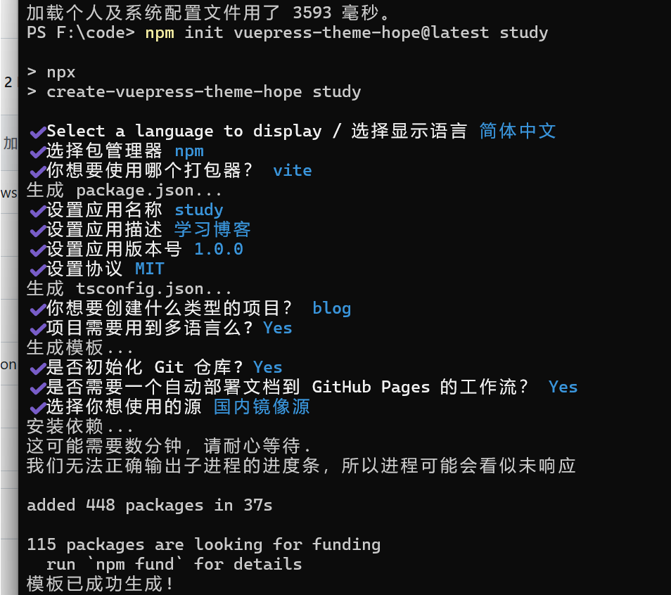
1.然后进入**github**，自己注册一个账号，创建一个仓库**repository**，仓库名字为**study**,如下
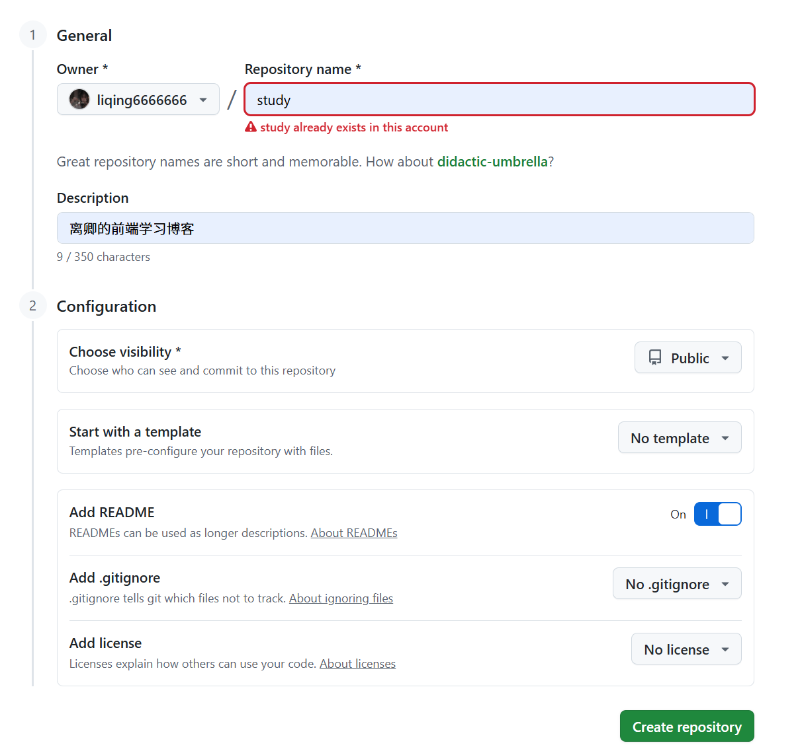
2.点击左侧的头像选择**setttings**,找到最下面的**Developer Settings**创建一个**token**，==复制，备用==
3.这里可能涉及密钥问题，因为很久之前就解决了，我懒得找怎么解决了，有需要的话可以去查一下不是很难
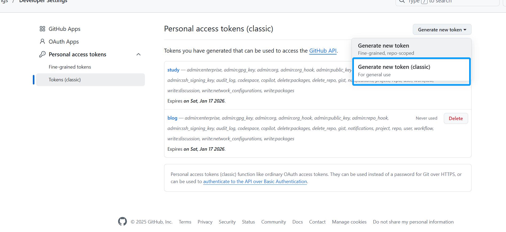
4.既然创建了token，那就需要将他添加到仓库里面，选择该仓库的**settings**
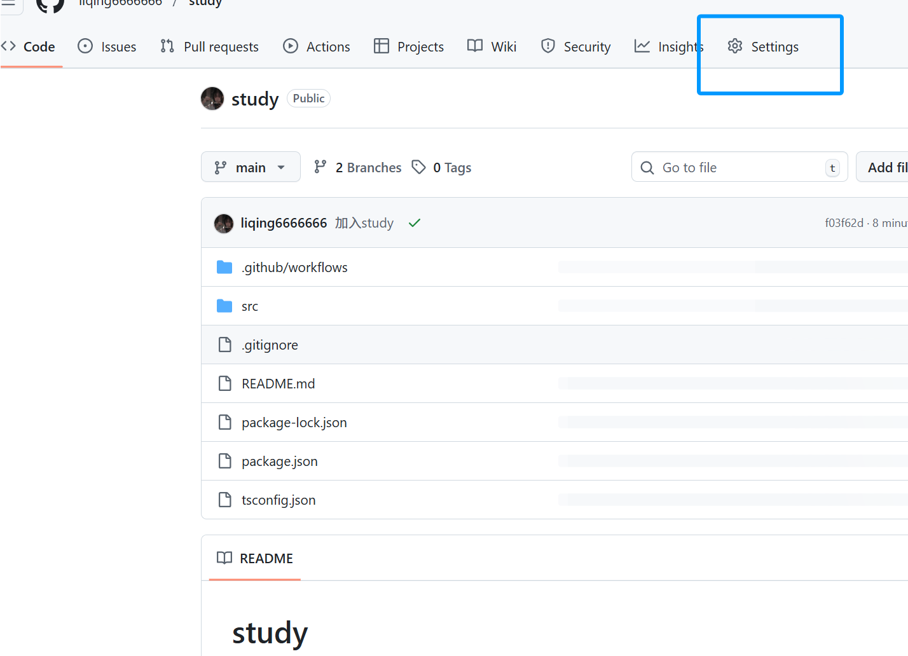
5.找到**Actions**
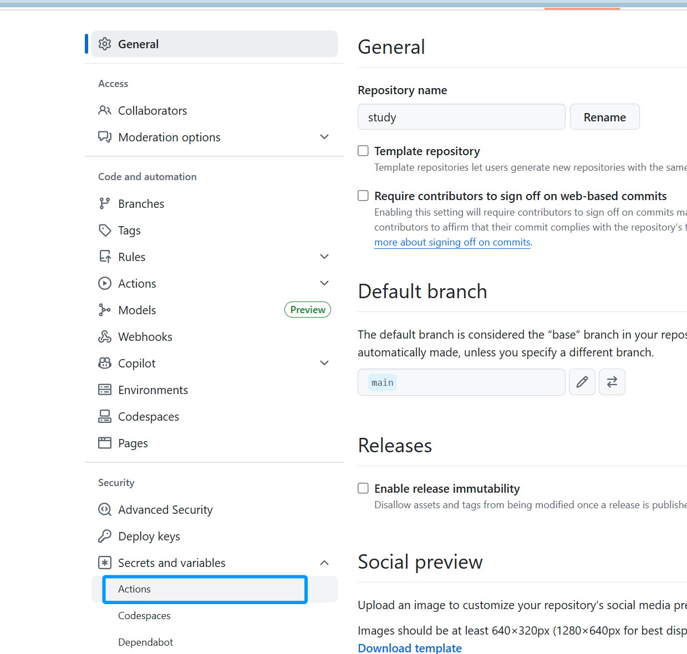
6.创建一个**New repository secret**,将之前创建的token粘贴到这里(从2复制的)
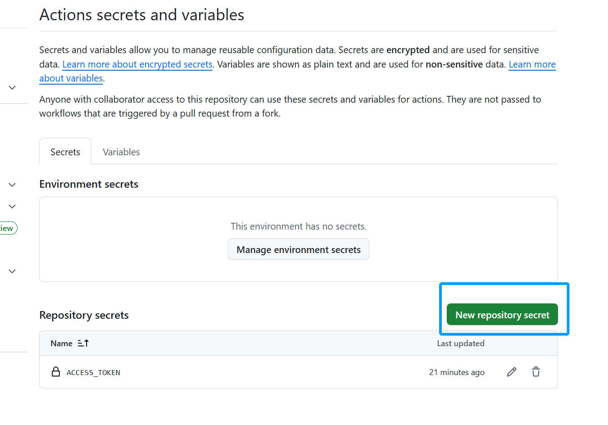
7.回到原来的仓库，创建一个**分支branch**，名字叫**blog_pages**之后要用
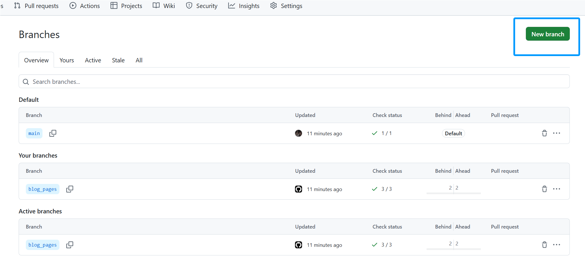
8.复制一下仓库的**url**
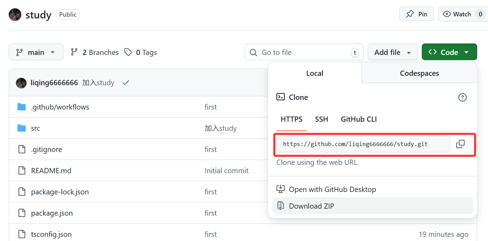

## 修改配置,推送仓库
1.使用**vscode**打开文件，找到**deploy-docs.yml**,添加一个env,具体如下,修改一下部署的分支为之前创建的分支名字**blog_pages**,env为之前在仓库添加的token的名字,我的为ACCESS。
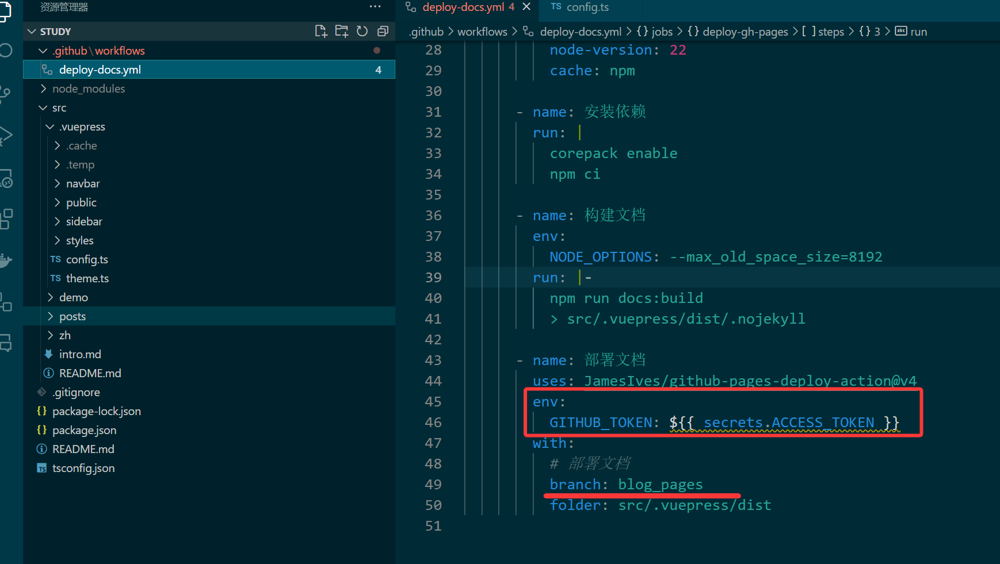
2.连接远程仓库需要之前仓库study的**url**,添加完后选择分支-合并，选择main主分支
合并后项目中会多一个文件叫做README.md的文件，这是之前创建仓库时创建的文件
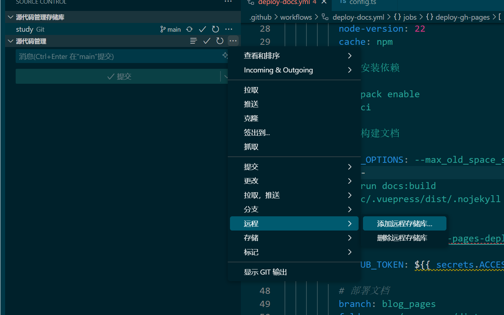
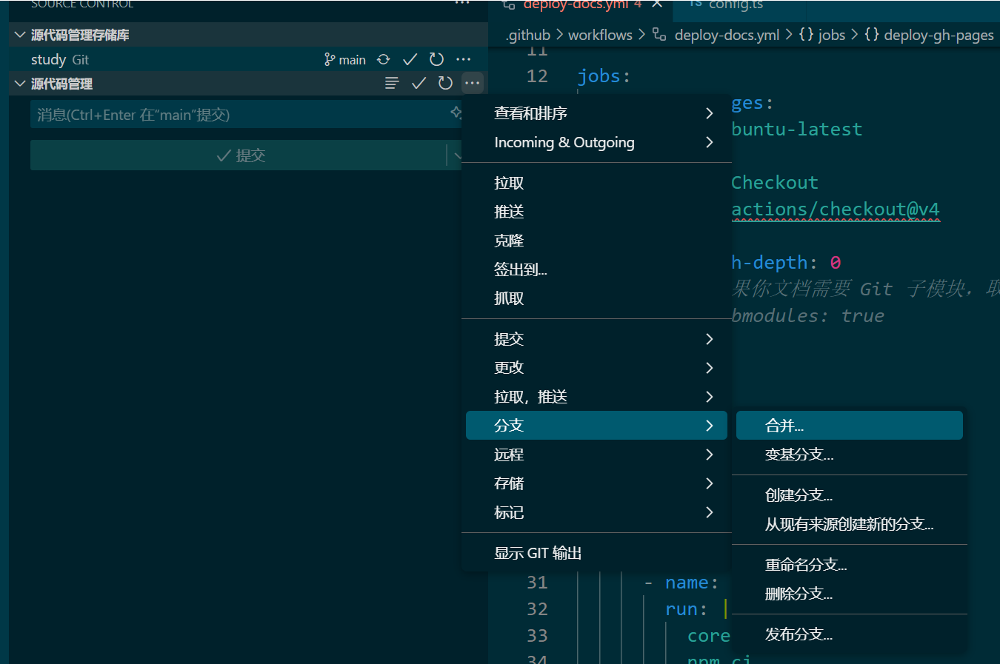
**注意：** 这里如果远程连接出错，就是访问不上github那大概率时**SSL**证书的问题
我会在2025-10-20更新这部分内容在git的内容中

## 静态部署
将所有内容在**vscode**的**源代码管理**处进行**提交**
然后回到github仓库，选择仓库的setting的**Pages**,选择分支blog_pages选择**save**
等待2-3分钟就会出现静态部署的网址了
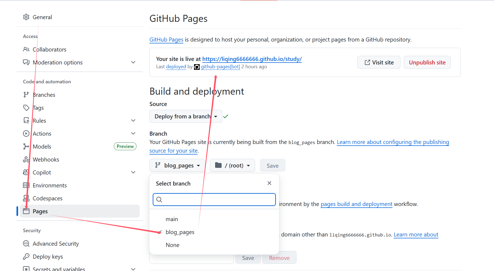