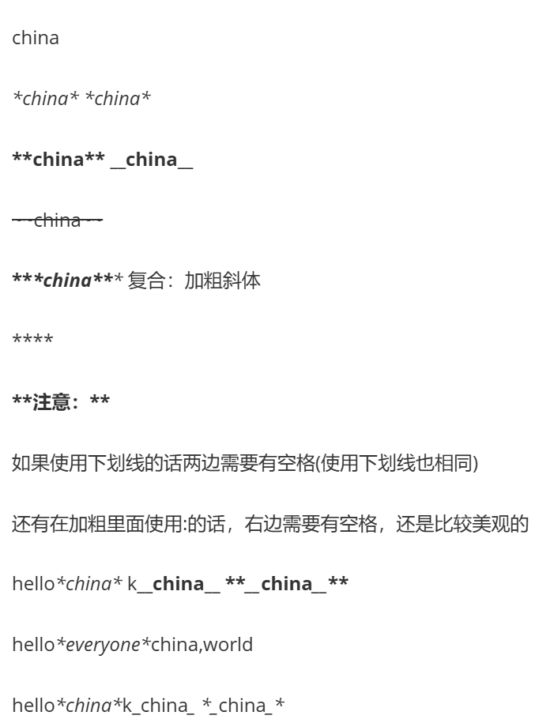
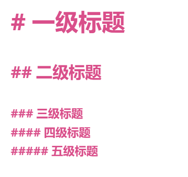
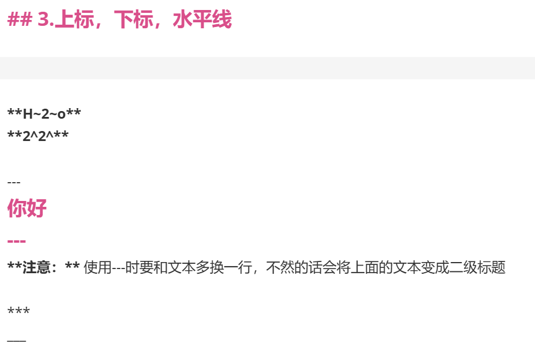
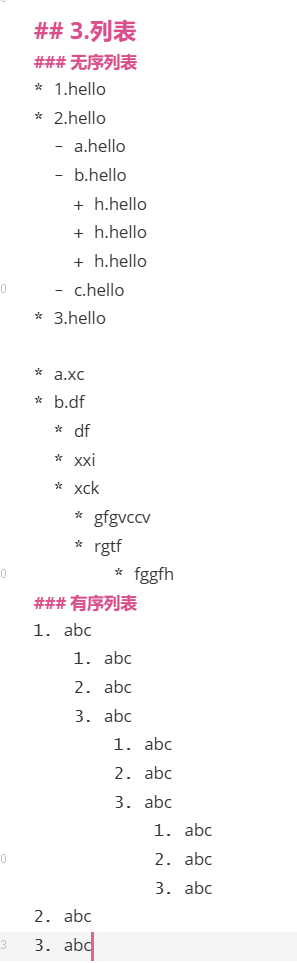
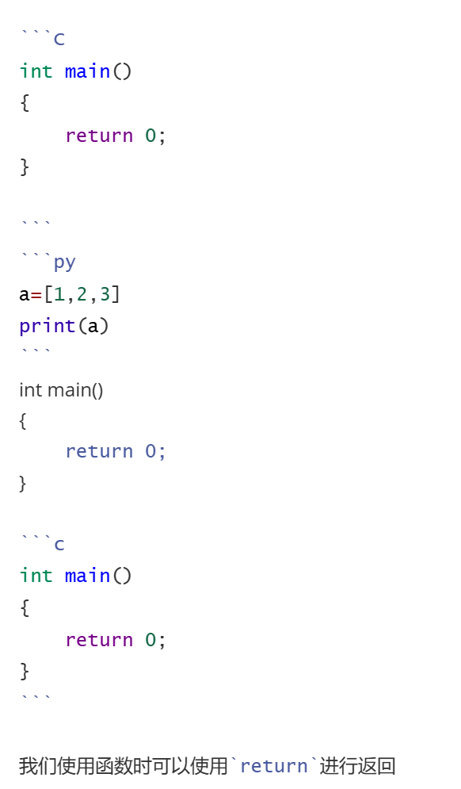
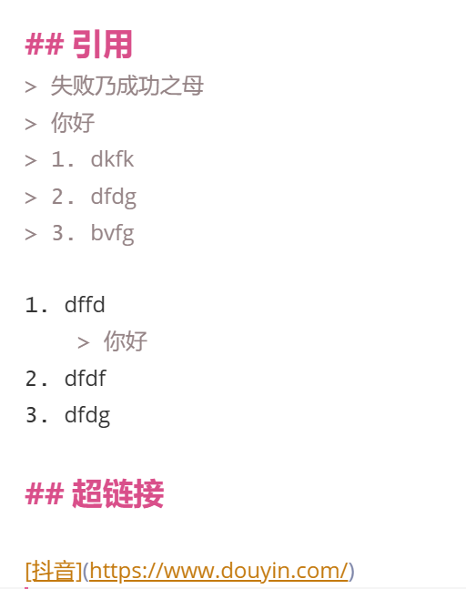
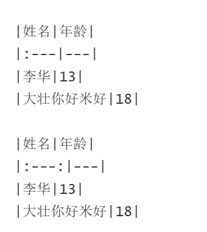
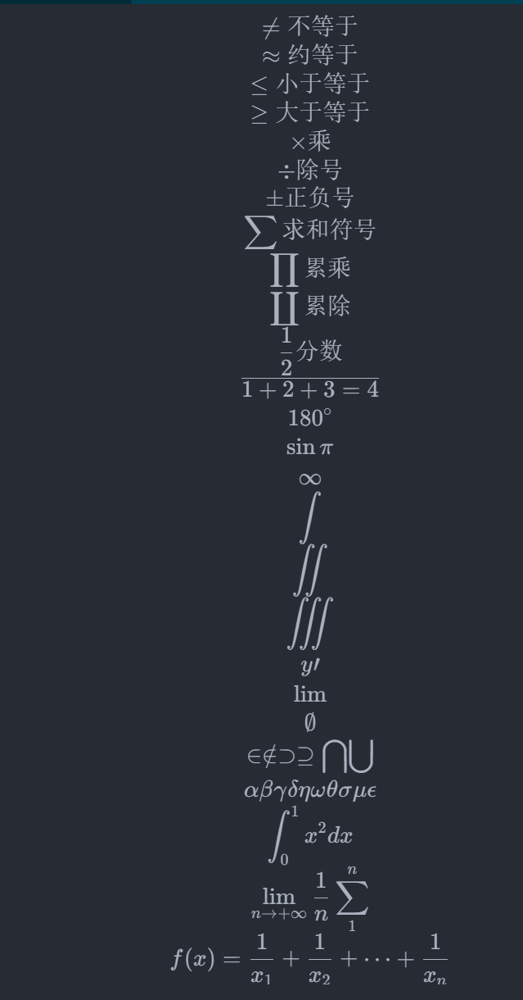

# Markdown学习

==对于不同的编辑器，markdown的部分语法不太一样，建议刚入门先使用<span style="color:red">vscode</span>熟练之后再使用<span style="color:red">Typora</span>==

Typora需要花钱激活，去淘宝会便宜一点，虽然低版本可以找教程激活，但是如果需要长期使用的话，建议使用正版，也是很期待平板的版本发布

## 1.加粗，斜体，删除线



china

*china* *china*

**china** __china__

~~china~~

***china*** 复合：加粗斜体

****

**注意：**

如果使用下划线的话两边需要有空格(使用下划线也相同)

还有在加粗里面使用:的话，右边需要有空格，还是比较美观的

hello*china* k__china__ **__china__**

hello*everyone*china,world

hello*china*k_china_ *_china_*

## 2.标题



# 一级标题

## 二级标题

### 三级标题
#### 四级标题
##### 五级标题

---

## 3.上标，下标，水平线



**H~2~o** 
**2^2^**

---
你好
---
**注意：** 使用---时要和文本多换一行，不然的话会将上面的文本变成二级标题

***
___

## 3.列表



### 无序列表

* 1.hello
* 2.hello
  - a.hello
  - b.hello
    + h.hello
    + h.hello
    + h.hello
  - c.hello
* 3.hello

* a.xc
* b.df
  * df
  * xxi
  * xck
    * gfgvccv
    * rgtf
        * fggfh

### 有序列表

1. abc
    1. abc
    2. abc
    3. abc
        1. abc
        2. abc
        3. abc
            1. abc
            2. abc
            3. abc
2. abc
3. abc

## 代码块



```C
int main()
{
    return 0;
}

```
```py
a=[1,2,3]
print(a)
```
int main()
{
    return 0;
}

```c
int main()
{
    return 0;
}
```

我们使用函数时可以使用`return`进行返回

## 引用



> 失败乃成功之母
> 你好
> 1. dkfk
> 2. dfdg
> 3. bvfg

1. dffd
    > 你好
2. dfdf
3. dfdg

## 超链接

[抖音](https://www.douyin.com/)

## 表格



|姓名|年龄|
|:---|---|
|李华|13|
|大壮你好米好|18|

|姓名|年龄|
|:---:|---|
|李华|13|
|大壮你好米好|18|

## HTML内容


<b>波浪号（~）</b>是一个有许多用途的标点符号。原本，它是作为缩写符号的一个字母，但亦有作为变音符号或单一文字的用途。<br/>在数学上，它是代表等价关系的数学符号。<br/>在最后一个用途里（尤其是在<span style="color:red">辞书学</span>里），它有时会被当作代字号。<br/>生物化学里表示高能磷酸键。

## 数学公式排版



$y=x+1$ 单行普通数学公式

$$
\not= 不等于\\
\approx 约等于\\
\leq 小于等于\\
\geq 大于等于\\
\times 乘\\
\div 除号\\
\pm 正负号\\
\sum 求和符号\\
\prod 累乘\\
\coprod 累除\\
\frac{1}{2} 分数\\
\overline{1+2+3=4}\\
180^\circ\\
\sin\pi\\
\infty\\
\int  \\\iint   \\\iiint\\
y\prime\\
\lim\\
\emptyset\\
\in \notin \supset \supseteq \bigcap \bigcup\\
\alpha \beta \gamma \delta \eta \omega \theta \sigma \mu \epsilon\\
\int_0^1x^2dx\\
\lim_{n\rightarrow+\infty}\frac{1}{n}
\sum_1^n\\
f(x)=\frac{1}{x_1}+\frac{1}{x_2}+\cdots+\frac{1}{x_n}
$$


