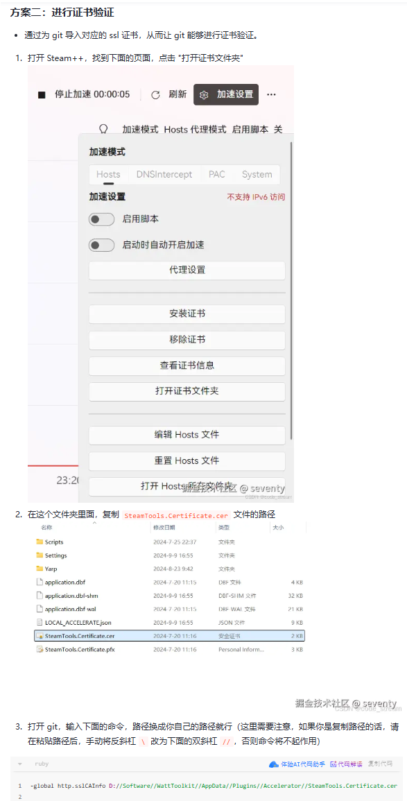
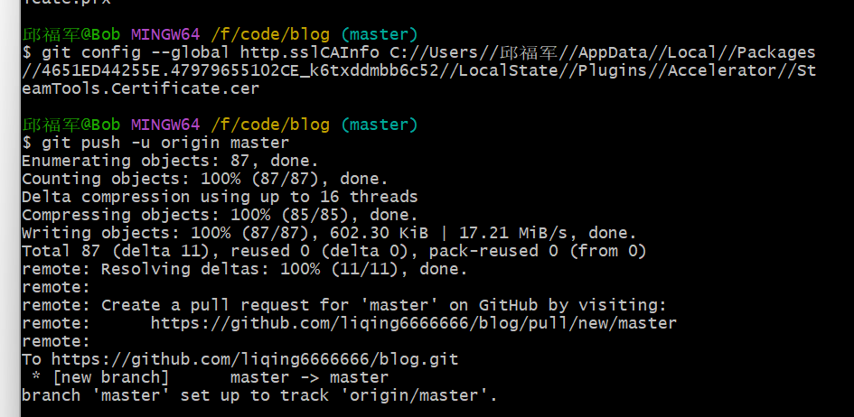

# SSL证书认证

在远程连接**github仓库**的时候报错

fatal: unable to access 'https://github.com/liqing6666666/blog.git/': SSL certificate problem: unable to get local issuer certificate

先去下载一个**watt tolkit**有的也叫stream++



打开证书文件夹，复制==StreamTools.Certificate.cer==文件注意不是.pfx的文件

**记得将地址中的\改为//**

```
-global http.sslCAInfo 地址
```

这个是我推送到github仓库时，出了点问题，解决后的图片

