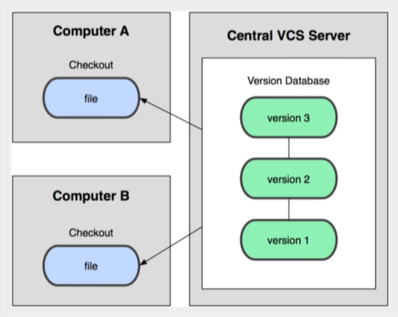

# git学习

[【狂神说Java】Git最新教程通俗易懂_哔哩哔哩_bilibili](https://www.bilibili.com/video/BV1FE411P7B3/?spm_id_from=333.337.search-card.all.click&vd_source=a6eb521e36b374fb3879195186734cb5)

学习参考上述链接

## 版本控制

版本控制是一种在开发过程中用于管理我们对文件、目录或工程内容的修改历史

，方便查看更改历史记录，备份以便于恢复以前版本的软件工程技术

* 实现跨区域多人协同开发
* 追踪和记录或者多个文件的历史记录
* 组织和保护你的源代码和文档
* 统计工作量
* 并行开发、提高开发效率
* 跟踪记录整个软件的开发过程
* 减轻开发人员的负担，节省时间，同时降低人为错误

简单说就是用于管理多人协同开发项目的技术。


多人开发就必须要适用版本控制，否则代价会比较大！

主流的版本控制器有如下这些

* **Git**
* **SVN**(Subversion)
* **CVS**(Concurrent Versions System)
* **VSS**(Micorosoft Visual SourceSafe)
* **TFS**(Team Foundation Server)
* Visual Studio Online

### 集中版本控制



所有的版本数据都保存在服务器上，协同开发者从服务器上同步更新或者上传自己的修改

所有的版本数据都存在服务器上，用户的本地只有自己以前所同步的版本，如果不联网的话，用户就看不到历史版本，也无法切换版本验证问题，或者在不同分支工作。而且，所有数据都保存在单一的服务器上，有很大的风险这个服务器会损坏，这样会丢失所有数据，当然可以定期备份，代表产品：SVN、CVS、VSS

### 分布式版本控制


**风险:**每个人都拥有全部的代码!安全隐患

所有的版本信息仓库全部同步到本地的每个用户，这样就可以在本地查看所有版本历史，可以离线在本地提交，只需要在连网时push到相应的服务器或者其他用户那里。由于每个用户那里保存的都是所有的版本数据，只要有一个用户的设备没有问题就可以恢复所有的数据，但这增加了本地储存空间的占用。

不会因为服务器损坏挥着网络问题，造成不能工作的情况!

### git和SVN最主要的区别

SVN是集中版本控制系统，版本库是集中放在中央服务器的，而工作的时候，用的都是自己的电脑，所以首先要从中央服务器的到最新的版本，然后工作，完成工作后，需要把自己做完的活推送到中央服务器，集中式版本控制系统是必须联网才能工作，对网络带宽的要求较高。

Git是分布式版本控制系统，没有中央服务器，每个人的电脑就是一个完整的版本库，工作的时候不需要联网，因为版本都在自己电脑上，协同的方法是这样的：比如说自己在电脑上改了文件A，其他人也在电脑上改了文件A，这时，你们俩之间只需要把各自的修改推送给对方，就可以互相看到对方的修改了。Git可以直接看到更新了哪些代码和文件!

Git是目前世界上最先进的分布式版本控制系统

## git历史

这个就截了一张图了解一下


## git下载

下载慢的话，直接找镜像源安装

**Git Bash**:Unix与Linux风格的命令行，使用最多，推荐最多

**Git CMD**:Windows风格的命令行

**Git GUI**:图形界面的Git,不建议初学者使用，尽量先熟悉常用命令

## git环境配置

查看配置 **git config -l**

查看系统配置 **git config --system --list**

查看全局配置(当前用户) **git config --global --list**

安装git后首先要做的就是设置你的用户名和e-mail地址.

```
git config --global user.name 名称
git config --global user.email 邮箱
```

**Git相关的配置文件：**

(1)Git\mingw64\etc\gitconfig:Git安装目录下的gitconfig  --system 系统级


(2)C:\Users\Administrator\.gitconfig 只适用于当前登录用户的配置  --global 全局

这里可以直接编辑配置文件，通过命令设置后会响应到这里.


## git基本理论（核心）

Git本地有三个工作区域：工作目录(Working Directory)、暂存区(Stage/Index)、资源库(Repository或者Git Directory).如果在加上远程的git仓库(Remote Directory)就可以分为四个工作区域。文件在这四个区域之间的转换关系如下：


* Workspace:工作区，就是你平时存放项目代码的地方
* Index/Stage:暂存区，用于临时存放你的改动，事实上它只是一个文件，保存即将提交到文件列表信息
* Repository:仓库区（或本地仓库），就是安全存放数据的地方，这里面有你提交到所有版本的数据。其中HEAD指向最新放入仓库的版本
* Remote:远程仓库，托管代码的服务器，可以简单地认为是你项目组中的一台电脑用于远程数据交换


* Directory:使用Git管理的一个目录，也就是一个仓库，包括我们的工作空间和Git的管理空间
* WorkSpace:需要通过Git进行版本控制的目录和文件，这些目录和文件组成了工作空间
* .git:存放Git管理信息的目录，初始化仓库的时候自动创建。
* Index/Stage:暂存区，或者叫待提交更新区，在提交进入repo之前，我们可以把所有的更新放在暂存区。
* Local Repo:本地仓库，一个存放在本地的版本库；HEAD会指向当前的开发分支(branch).
* Stash:隐藏，是一个工作状态保存栈，用于保存/恢复WorkSpace中的临时状态.

git的工作流程一般是这样的:

1. 在工作目录中添加、修改文件
2. 将需要进行版本管理的文件放在暂存区；
3. 将暂存区的文件提交到git仓库。

因此，git管理的文件有三种状态：已修改(modified),已暂存(staged),已提交(committed)


## Git项目搭建

工作目录(WorkSpace)一般就是你希望Git帮助你管理的文件夹，可以是你项目的目录，也可以是一个空目录，建议不要有中文


```
git init 创建全新仓库
git clone [url] 克隆远程仓库
```


