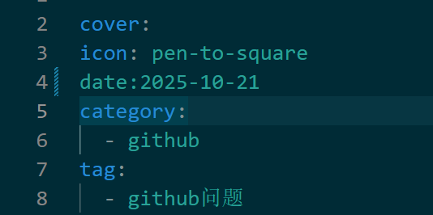

# YAML简介

**YAML**(YAML Aint't Markup Language,即YAML不是一种标记语言)是一种高刻度的数据序列化的语言，可以被大多数编程语言支持使用，主要用于数据序列化、配置文件。

它最初代表“Yet Another Markup Language”,但后来更改为“YAML Ain't Markup Language”,以区别于真正的标记语言。

数据序列化，就是可以高效的表示或描述数据及数据关系的，以便于储存和运输。

**优点：**

* 语法简单
* 结构清晰，易于阅读
* 功能丰富，可以描述比JSON更加复杂的结构

下面是一个json代码和YAML代码的对比
```json
{
	"id":1,
	"name":"zhangsan",
	"job":{
		"name":"程序员"
	}
}
```

```yaml
name: zhangsan
age: 20
job:
	name: 程序员
```

**yaml可以看成简化增强后的json，在json的基础上，yaml进行了简化没有了多余的大括号，结构依靠缩进，在json中是不可以加注释的，但是在yaml中是可以的**

**缺点：**空格缩进非常严格，**name:空格+zhangsan**要留意空格造成的语法不生效问题

## 基本语法

* 大小写敏感
* 使用缩进表示层级关系
* 缩进不予许使用tab，只予许空格
* 缩进的空格数不重要，只要相同层级的元素左对齐即可
* '#'表示注释

```yaml
name:张三
```

> YAMLException: can not read a block mapping entry; a multiline key may not be an implicit key at line 4, column 1: ^

就会有报错，但是在某些编辑器中不会提示,可能只是**颜色的变化**，可能会被忽略

观察下面的date数据和其他数据的不同



建议刚入手的同学可以先在网页的[yaml在线编辑器]([YAML、YML在线编辑器(格式化校验) - JSON中文网](https://www.json.cn/yaml-editor/))先写好没有报错后，在复制到自己文件，这个在线编辑器有**检错**的功能

## 数据类型

YAML支持一下几种数据类型：

* 对象：键值对的集合，又称为映射(mapping)，对应json中的属性

* 数组：一组有序的值，又称为列表

* 纯量：单个的、不可再分的值

  - 字符串

    + 默认无需引号: my_string: YAML

    + 单引号(''):不会转义特殊字符，所有内容视为字面量

    + 双引号(""): 会转义特殊字符，例如\n会被解析为换行符

      ```yaml
      companies:
          name: xx有限公司
          Name: 'xx有限公司'
      ```

      这两个的值一样

      

  - 布尔值

  - 整数

  - 浮点数

  - Null

  - 时间

  - 日期

### 对象

```yaml
app:
    name: IT教育
    type: 教育培训
```

app为一个对象,name: IT教育和type: 教育培训为值,为两个键值对的集合,当然对象也可以包括其他对象，因为对象就是**键值对的集合**

### 数组

数组有两种写法

```yaml
job:
    - java开发
    - python开发
    - 前端开发
```

这里注意**-**和**内容**之间要有**空格**

```
job: [java开发,python开发,前端开发]
```

注意job的**冒号**与**[]**之间需要有**空格**

### 纯量

```yaml
boolean: 
    - TRUE  #true,True都可以
    - FALSE  #false，False都可以
float:
    - 3.14
    - 6.8523015e+5  #可以使用科学计数法
int:
    - 123
    - 0b1010_0111_0100_1010_1110    #二进制表示
null:
    nodeName: 'node'
    parent: ~  #使用~表示null
string:
    - 哈哈
    - 'Hello world'  #可以使用双引号或者单引号包裹特殊字符
    - newline
      newline2    #字符串可以拆成多行，每一行会被转化成一个空格
date:
    - 2018-02-17    #日期必须使用ISO 8601格式，即yyyy-MM-dd
datetime: 
    -  2018-02-17T15:02:31+08:00    #时间使用ISO 8601格式，时间和日期之间使用T连接，最后使用+代表时区
```

### 复合

```yaml
companies:
    -
        id: 1
        name: company1
        price: 200W
    -
        id: 2
        name: company2
        price: 500W
```

```json
{
  "companies": [
    {
      "id": 1,
      "name": "company1",
      "price": "200W"
    },
    {
      "id": 2,
      "name": "company2",
      "price": "500W"
    }
  ]
}
```

意思是 companies 属性是一个数组，每一个数组元素又是由 id、name、price 三个属性构成。

### 复杂

使用**问号“?”**声明一个复杂对象，允许你使用多个词汇（数组）来组成键

```yaml
?
  - key1
  - key2
:
  - value1
  - value2
```

```json
{
  "key1,key2": [
    "value1",
    "value2"
  ]
}
```

## 锚点、合并、引用

**& 用来建立锚点（defaults），<< 表示合并到当前数据，* 用来引用锚点。**

```yaml
defaults: &defaults
  adapter:  postgres
  host:     localhost

development:
  database: myapp_development
  <<: *defaults

test:
  database: myapp_test
  <<: *defaults
```

相当于下面的代码

```yaml
defaults:
  adapter:  postgres
  host:     localhost

development:
  database: myapp_development
  adapter:  postgres
  host:     localhost

test:
  database: myapp_test
  adapter:  postgres
  host:     localhost
```

```yaml
- &showell Steve 
- Clark 
- Brian 
- Oren 
- *showell 
```

转成json相当于

```yaml
[ 'Steve', 'Clark', 'Brian', 'Oren', 'Steve' ]
```

## 多行文本

```yaml
about: |
  第一行
  第二行
  第三行
text: >
  第一行
  第二行
  第三行
  
  第四行
  第五行
  第六行
```

```json
{
  "about": "第一行\n第二行\n第三行\n",
  "text": "第一行 第二行 第三行\n第四行 第五行 第六行\n"
}
```

字面量块 | :保留每一个换行。适合要“按原样呈现”的文本

折叠块 > :把换行折叠为空格，仅保留最后一个换行（空行保留为换行）

## 强制类型转换

YAML 支持使用**严格类型标签“!!”**（双感叹号+目标类型）来强制转换类型

```yaml
a: !!float '666' # !! 为严格类型标签
b: '666' # 其实双引号也算是类型转换符
c: !!str 666 # 整数转为字符串
d: !!str 666.66 # 浮点数转为字符串
e: !!str true # 布尔值转为字符串
f: !!str yes # 布尔值转为字符串
g: !!int '4'
```

```json
{
  "a": 666,
  "b": "666",
  "c": "666",
  "d": "666.66",
  "e": "true",
  "f": "yes",
  "g": 4
}
```


==备注:以上有很多例子参考菜鸟教程==
